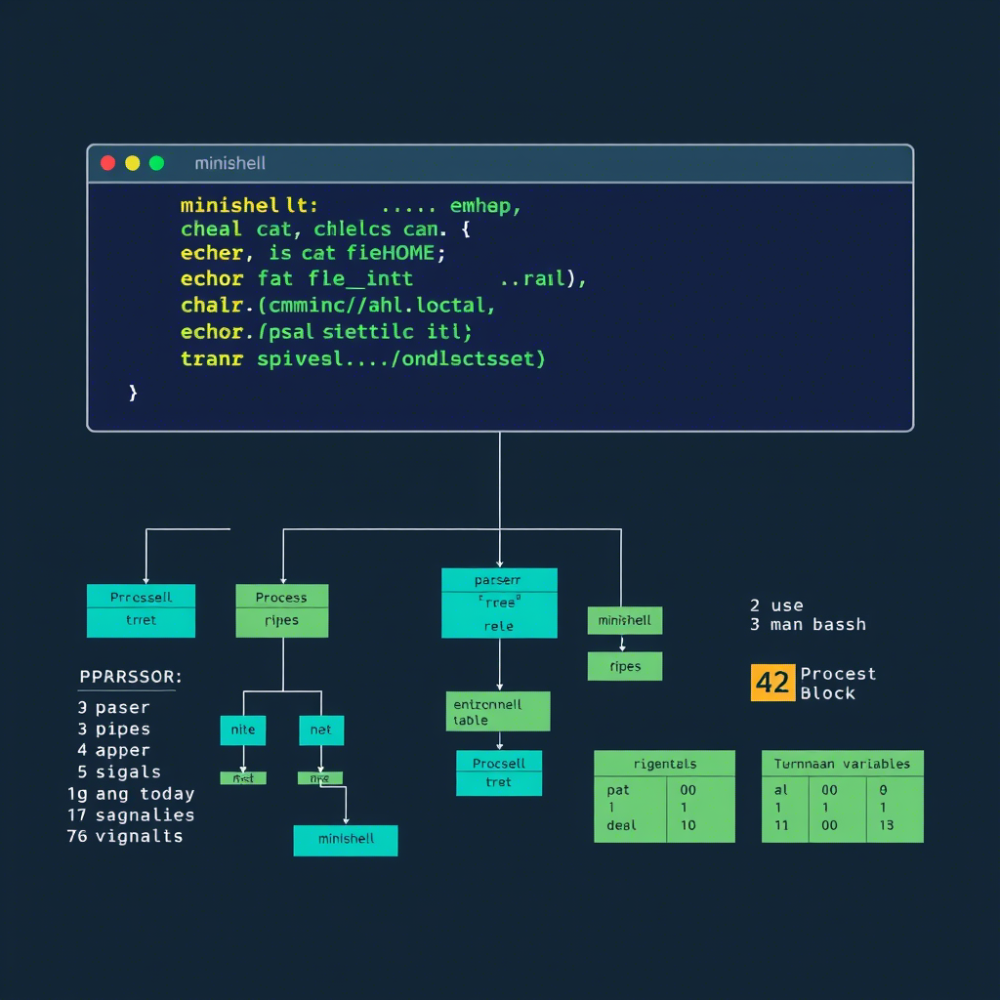

# 🐚 Minishell



A simplified shell implementation for 42 School.

## 👥 Team

This project was created with passion and lots of debugging by:
- [Youssef El Mountahi](https://github.com/elmountahiii)
- [Anouar Et Taleb](https://github.com/saitama213g)

## 📝 Description

Minishell is a custom shell implementation that mimics the functionality of bash, but with a limited set of features. This project is part of the 42 School curriculum and aims to deepen understanding of processes, file descriptors, and signal handling in Unix-like operating systems.

Our shell provides a command prompt and waits for user input, then parses and executes commands according to shell syntax rules.

## ✨ Features

- Command prompt with history navigation
- Command execution via PATH variable
- Handling of quotes (`'` and `"`) and escape characters (`\`)
- Environment variable expansion (`$VAR`)
- Signal handling (Ctrl+C, Ctrl+D, Ctrl+\)
- Redirections:
  - Input redirection (`<`)
  - Output redirection (`>`)
  - Append output redirection (`>>`)
  - Here document (`<<`)
- Pipes (`|`) for command chaining
- Built-in commands:
  - `echo` with `-n` option
  - `cd` with relative or absolute path
  - `pwd` without options
  - `export` without options
  - `unset` without options
  - `env` without options or arguments
  - `exit` with exit status

## 🛠️ Technologies Used

- Language: C
- Build system: Make
- Libraries: Readline for command history

## 🚀 Installation

```bash
# Clone the repository
git clone https://github.com/Elmountahiii/minishell

# Navigate to the project directory
cd minishell

# Compile the project
make

# Run minishell
./minishell
```

## 📚 Usage

```bash
# Simple commands
minishell$ ls -la
minishell$ pwd

# Command with redirections
minishell$ ls > files.txt
minishell$ cat < files.txt

# Command with pipes
minishell$ ls -la | grep .c
minishell$ cat file.txt | grep pattern | wc -l

# Environment variables
minishell$ echo $HOME
minishell$ export VAR=value
minishell$ echo $VAR

# Built-in commands
minishell$ cd /path/to/directory
minishell$ echo Hello World
minishell$ exit 42
```

## 🏗️ Project Structure

```
minishell/
├── Makefile
├── main.c
├── minishell.h
├── builtins/
│   ├── cd.c
│   ├── echo.c
│   ├── env.c
│   ├── exit.c
│   ├── export.c
│   └── ...
├── clean/
│   ├── ft_clean_array.c
│   ├── ft_clean_commands.c
│   ├── ft_clean_files.c
│   └── ...
├── commands/
│   └── ...
├── env/
├── execution/
├── expand/
├── files/
├── heredoc/
├── lib/
├── pipes/
├── setup/
├── spliting/
├── syntax/
├── tokens/
├── utils/
└── wildcards/
```

## 🧪 Testing

We've tested our minishell extensively with various command combinations, including:
- Simple commands with arguments
- Commands with environment variables
- Command chaining with pipes
- Input/output redirections
- Edge cases like empty input, invalid commands, and syntax errors

## 🔍 Challenges and Solutions

### Challenge 1: Command Parsing
We implemented a lexer and parser to tokenize and analyze command input, handling quotes, spaces, and special characters properly.

### Challenge 2: Signal Handling
Managing signals (Ctrl+C, Ctrl+D) required careful consideration of when to reset signal handlers, especially during command execution.

### Challenge 3: Managing File Descriptors
Implementing pipes and redirections required meticulous